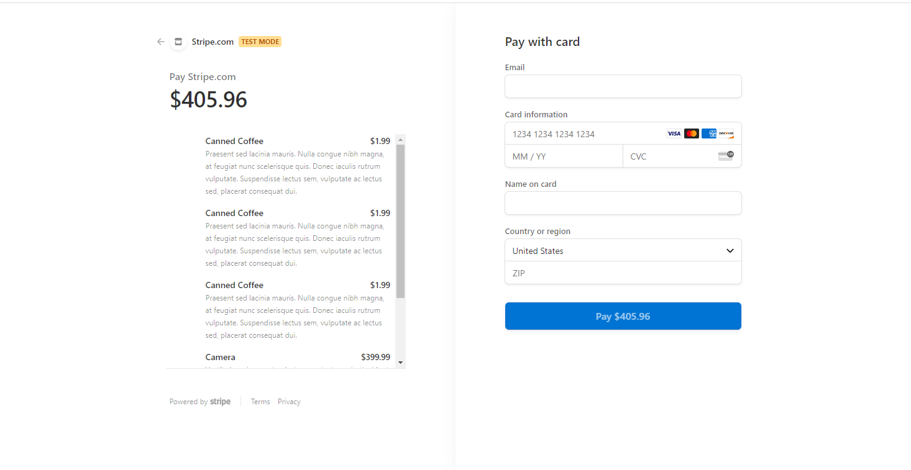

# reduxStore

## Description

In this unit, you learned how to manage global state using React’s Context API. The Context API is quickly gaining traction as a worthy alternative or perhaps even successor to other libraries that manage global state in tandem with React, such as Flux or MobX. Nonetheless, the open source JavaScript library Redux remains the industry standard for managing complex state in a large-scale React application, and you’ll likely encounter it on the job.

Your challenge this week is to refactor the e-commerce platform from Activity 26 so that it uses Redux.

## Installation and Start

npm i, npm run seed, npm run develop

## Link to deployed site

[reduxStore](https://reduxstorejjk.herokuapp.com/)

## Screenshots

## Questions

If you have any questions, please refer to my Github page, [JamieKaczor](https://github.com/JamieKaczor), or contact me through my email, Dignanjk@aol.com